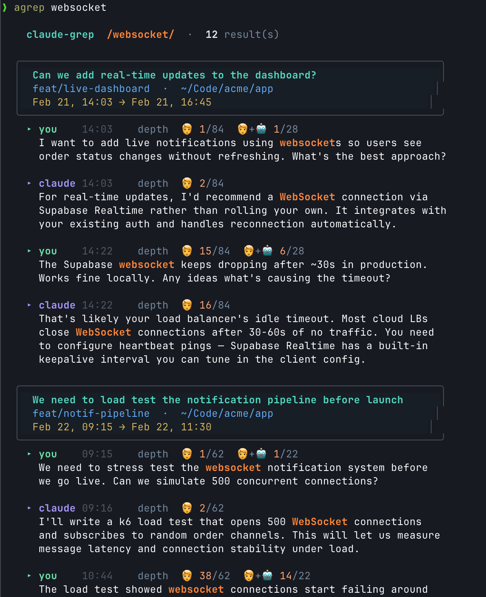

# chaimber-cliutils

Standalone CLI tool for searching Claude Code session logs.

## claudegrep

Search Claude Code conversation logs with rich, colorized output.

```bash
claudegrep "inngest"                    # search all messages (user + assistant)
claudegrep -u "bulk price"              # search user messages only
claudegrep -a "auth flow"               # search assistant/agent messages only
claudegrep -p manapool "auth"           # filter to a specific project
claudegrep -n 5 "TODO"                  # limit to 5 results
claudegrep --list-projects              # list available projects
```



**Dependencies:** `jq`, `rg` (ripgrep)

## Install

### Standalone

```bash
git clone https://github.com/echochamber/chaimber-cliutils.git
cd chaimber-cliutils
./install.sh
```

This symlinks claudegrep into `~/.claude/scripts/`. Ensure that directory is on your PATH:

```bash
export PATH="$HOME/.claude/scripts:$PATH"
```

### As a submodule

```bash
git submodule add https://github.com/echochamber/chaimber-cliutils.git dev/cliutils
dev/cliutils/install.sh
```

## Options

```
./install.sh              # install (updates existing symlinks)
./install.sh --dry-run    # show what would happen
./install.sh --force      # overwrite existing files (not just symlinks)
```
